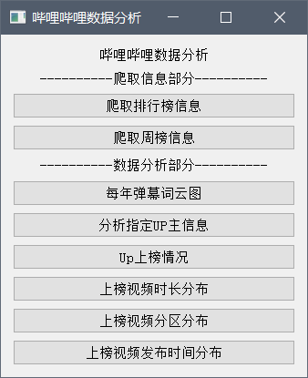
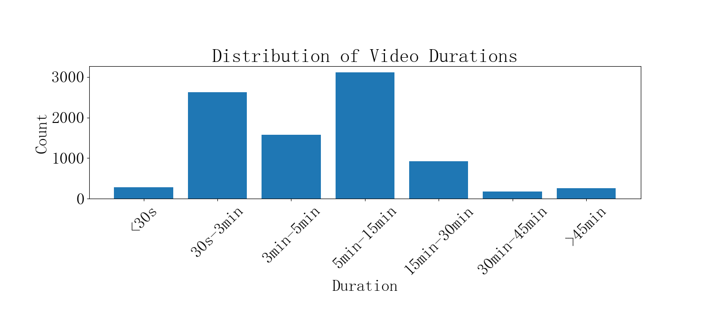
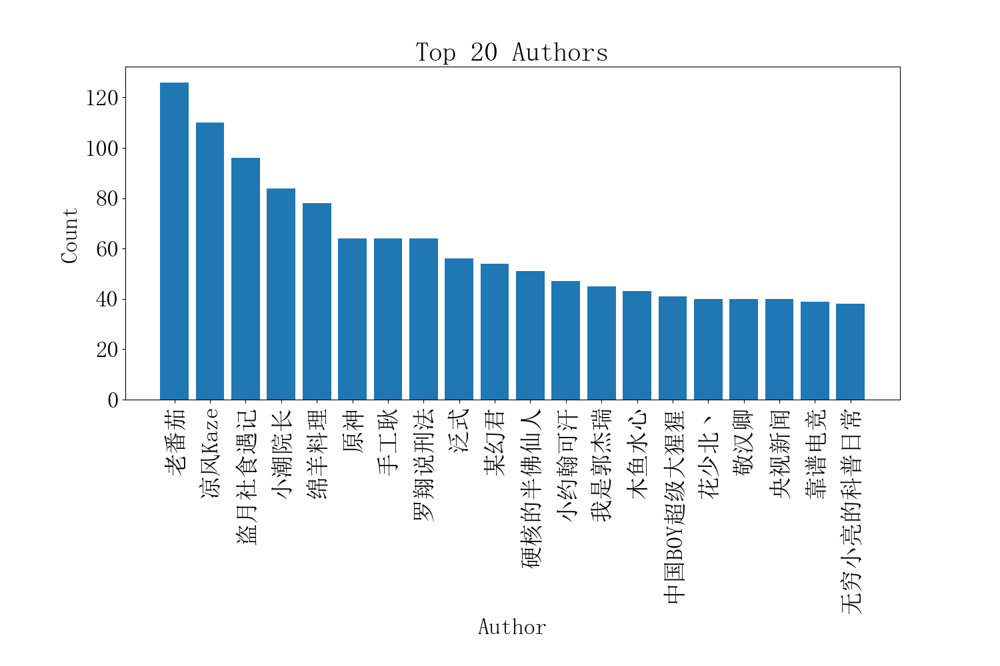
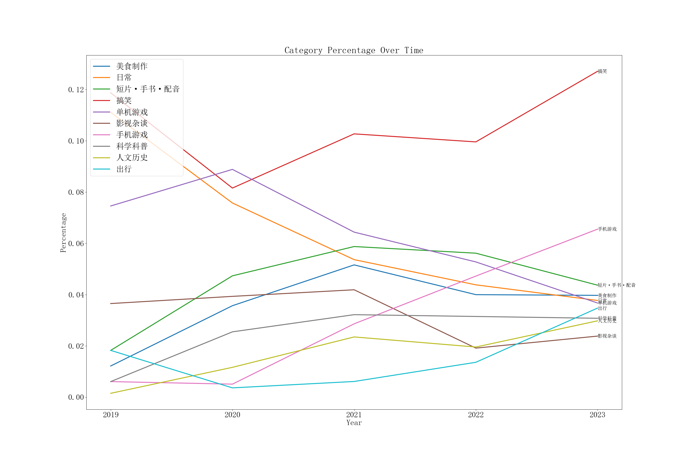
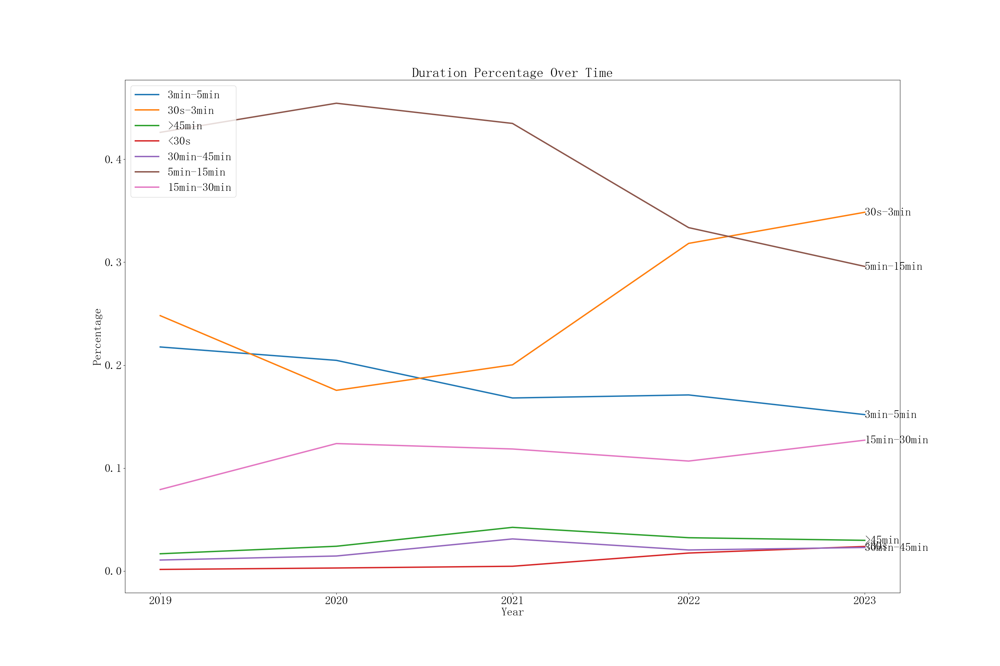

# bilibili_analysis
**对bilibili网站进行数据爬取及统计分析，总体功能分为数据爬取和数据统计分析两部分，同时拥有简单的图形化界面。其中数据爬取采用Scrapy，数据统计分析部分主要是对所爬取的数据进行可视化，plot绘制出图表。**

## 数据爬取

* 爬取排行榜
* 爬取每周必看
* 爬取视频信息
* 爬取视频的弹幕信息（此功能开关未在图形化界面上提供，默认开启，开启后爬取的数据量较大。如需关闭需自行修改 bilibili_scrapy/bilibili_scrapy/spiders/bilibili_spider.py 文件中 is_get_bulletScreen 值）

## 数据统计分析

* 弹幕分析-词云图 

* UP主上榜情况

* UP主的成长路线（UP上榜视频数变化）

* 如何做出一个能上榜的视频？
  * 上榜视频时长/分区的总体分布
  
  * 上榜视频时长/分区的热度变化趋势
  
  * 上榜视频时间分布及趋势（每周星期几每天时段）
  
    

## 界面

## 示例结果

本次结果截至2023/6/16 8:20。以下是数据分析后产生的部分结果图。

